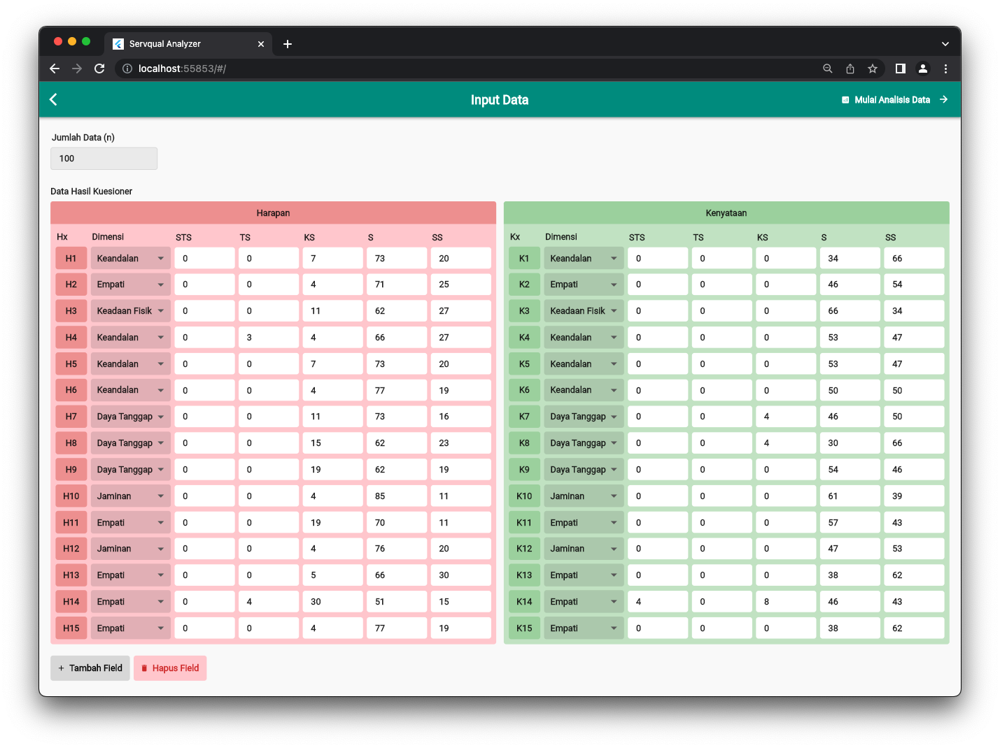
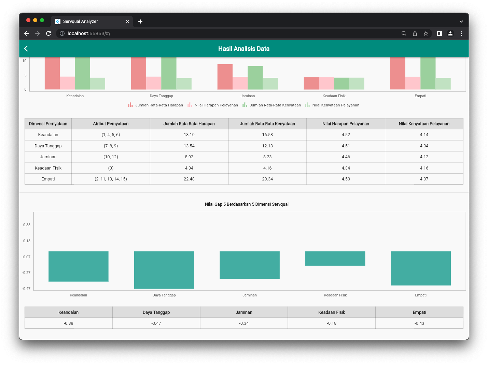

# Service Quality Analyzer
Servqual merupakan salah satu metode untuk mengukur kualitas pelayanan pelayanan dapat diukur dari lima dimensi, yaitu: Tangibles, Reliability, Responsiveness, Assurance dan Empathy

Full Demo:

https://www.elrizwiraswara.com/apps/servqual/

Builded using Flutter
